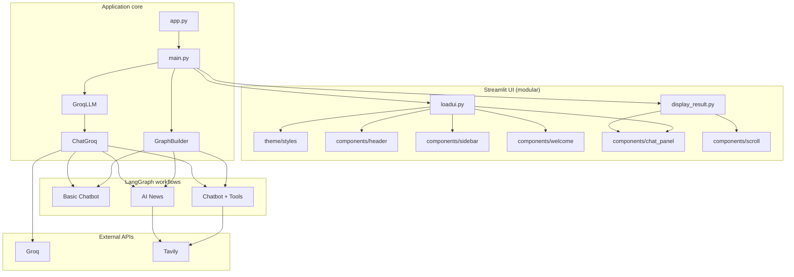

<div align="center">

# 🤖 Pixie — Agentic AI Chatbot

**Stateful LangGraph agents · Groq inference · Live web search — deployed on Streamlit Cloud**

[](https://www.python.org/)
[](https://langchain-ai.github.io/langgraph/)
[](https://streamlit.io/cloud)
[](https://groq.com/)
[](https://tavily.com/)

</div>

---

## Overview

**Pixie** is a production-deployed demo of **agentic AI** built with LangGraph. Three use cases share one Streamlit UI: basic chat, web-grounded ReAct agents, and an automated AI news digest pipeline.

| | |
|---|---|
| **Live app** | [pixie-the-ai.app](https://pixie-the-ai.streamlit.app/) |
| **Repository** | [github.com/Ahad9044/Agentic-Chatbot](https://github.com/Ahad9044/Agentic-Chatbot) |
| **Entry point** | `app.py` |

---

## ✨ Features

| Mode | What it does | LangGraph pattern |
|------|----------------|-------------------|
| **Basic Chatbot** | Conversational Q&A with LLM | `START → chatbot → END` |
| **Chatbot With Web** | Answers with live Web search | **ReAct loop** with `tools_condition` |
| **AI News Explorer** | Daily / weekly / monthly AI news digest | **Pipeline**: fetch → summarize → save |


### Engineering highlights

- Stateful graphs with `add_messages` reducer  
- One `GraphBuilder` compiles the graph per use case  
- Cross-platform config (`uiconfigfile.ini` via `pathlib`)  
- Deployed on **Streamlit Community Cloud**

---

## 🏗 Architecture



### LLM integration

| Step | Component | Role |
|------|-----------|------|
| 1 | Sidebar + `LLM` | User picks model and supplies API key |
| 2 | `Chat` | Single LangChain chat model passed into all nodes |
| 3 | Basic chat | `llm.invoke(messages)` |
| 4 | Web chat | `llm.bind_tools(tavily)` + ReAct routing |
| 5 | AI News | `llm.invoke` in summarize step after Tavily fetch |

### Request flow

1. User configures **LLM** (and **Tavily** if needed) in the sidebar.  
2. `GroqLLM.get_llm_model()` returns `ChatGroq`.  
3. `GraphBuilder.setup_graph(usecase)` compiles the LangGraph.  
4. User message (or news timeframe) runs through the graph.  
5. `DisplayResultStreamlit` appends to chat history and rerenders the conversation panel.

---

## 🛠 Tech Stack

| Layer | Technologies |
|-------|----------------|
| Orchestration | LangGraph, LangChain Core |
| LLM | Groq (`langchain-groq`) — Llama 3.1 8B, Llama 3.3 70B, GPT-OSS 120B |
| Search | Tavily (`tavily-python`) |
| Frontend | Streamlit (Community Cloud) |
| Language | Python 3.11+ |

---

## 📁 Project Structure

```
AgenticChatbot/
├── app.py                          # Streamlit entry (Cloud main file)
├── requirements.txt
├── .streamlit/
│   └── config.toml                 # Theme (dark, brand colors)
├── AINews/                         # Generated news markdown
└── src/langgraphagenticai/
    ├── main.py                     # App orchestration + chat input
    ├── graph/graph_builder.py
    ├── state/state.py
    ├── nodes/                      # basic, tool, news nodes
    ├── tools/search_tool.py
    ├── LLMS/groqllm.py
    └── ui/
        ├── uiconfigfile.ini        # Page title, models, use cases
        ├── uiconfigfile.py
        └── streamlitui/
            ├── loadui.py
            ├── display_result.py
            ├── theme/
            │   ├── styles.py       # Global CSS
            │   └── constants.py
            └── components/
                ├── header.py       # Site branding bar
                ├── sidebar.py      # Agent console
                ├── welcome.py      # Empty-state greeting
                ├── chat_panel.py   # Conversation thread
                ├── scroll.py       # Auto-scroll helper
                └── session.py
```

---

## 🌐 Deploy on Streamlit Cloud

This project is deployed on [Streamlit Community Cloud](https://streamlit.io/cloud).

### Live application

**URL:** [https://pixie-the-ai.com](https://pixie-the-ai.streamlit.app/)

### Deploy your own fork

1. Fork [Agentic-Chatbot](https://github.com/Ahad9044/Agentic-Chatbot).  
2. Go to [share.streamlit.io](https://share.streamlit.io) → **New app**.  
3. Select your repo, branch `main`, and set **Main file path** to:

   ```
   app.py
   ```


4. Click **Deploy**.

### Using the live app

1. Open [pixie-the-ai.com](https://pixie-the-ai.streamlit.app/).  
2. In the sidebar, enter your **[API key](https://console.groq.com/keys)**.  
3. For **Chatbot With Web** or **AI News**, also add a **[Tavily API key](https://app.tavily.com/home)**.  
4. Choose a **use case** and **model**, then chat or fetch news.

> API keys can be typed in the sidebar (recommended for demos) or set as Streamlit secrets so you do not need to enter them each session.

### Production notes

- Config loads from `uiconfigfile.ini` using a path relative to the module file — works on Linux (Cloud) and Windows.  
- Dependencies are listed in `requirements.txt` (installed automatically on deploy).  
- App title and branding come from `uiconfigfile.ini` (`PAGE_TITLE = Pixie : Your AI Assistant`).

---

## 🚀 Run locally

### Prerequisites

- Python **3.11+**
- [Groq API key](https://console.groq.com/keys)
- [Tavily API key](https://app.tavily.com/) — for web chat and AI News

### Steps

```bash
git clone https://github.com/Ahad9044/Agentic-Chatbot.git
cd Agentic-Chatbot

python -m venv venv

# Windows
venv\Scripts\activate

# macOS / Linux
source venv/bin/activate

pip install -r requirements.txt
streamlit run app.py
```

Open **http://localhost:8501**.

### Optional `.env` (local only)

```env
GROQ_API_KEY=your_groq_key
TAVILY_API_KEY=your_tavily_key
```

Do not commit `.env` — it is listed in `.gitignore`.

---

## 💡 Design Decisions

- **Graph-per-use-case** — Separate LangGraph topologies keep behavior predictable.  
- **Node modularity** — `BasicChatbotNode`, `ChatbotWithToolNode`, `AINewsNode`.  
- **Config-driven UI** — Models and modes from `uiconfigfile.ini`.  
- **Modular frontend** — CSS theme + small components instead of one monolithic UI file.  
- **Streaming vs invoke** — Basic chat streams; tool and news flows use `invoke()`.

---

## 🔮 Possible Extensions

- Session persistence (LangGraph checkpointer / SQLite)  
- RAG over documents (FAISS is already in `requirements.txt`)  
- LangSmith tracing  
- FastAPI layer alongside Streamlit  
- Auth and rate limiting for public deployments  

---

## 📄 License

MIT License

Copyright (c) 2026 Pixie-the-ai

Permission is hereby granted, free of charge, to any person obtaining a copy
of this software and associated documentation files (the "Software"), to deal
in the Software without restriction, including without limitation the rights
to use, copy, modify, merge, publish, distribute, sublicense, and/or sell
copies of the Software, and to permit persons to whom the Software is
furnished to do so, subject to the following conditions:

The above copyright notice and this permission notice shall be included in all
copies or substantial portions of the Software.

THE SOFTWARE IS PROVIDED "AS IS", WITHOUT WARRANTY OF ANY KIND, EXPRESS OR
IMPLIED, INCLUDING BUT NOT LIMITED TO THE WARRANTIES OF MERCHANTABILITY,
FITNESS FOR A PARTICULAR PURPOSE AND NONINFRINGEMENT. IN NO EVENT SHALL THE
AUTHORS OR COPYRIGHT HOLDERS BE LIABLE FOR ANY CLAIM, DAMAGES OR OTHER
LIABILITY, WHETHER IN AN ACTION OF CONTRACT, TORT OR OTHERWISE, ARISING FROM,
OUT OF OR IN CONNECTION WITH THE SOFTWARE OR THE USE OR OTHER DEALINGS IN THE
SOFTWARE.

---

## 👤 Author

**Ahad** — [GitHub](https://github.com/Ahad9044)

Agentic AI engineering demo: LangGraph orchestration, tool use, Groq + Tavily, and Streamlit Cloud deployment.

---

<div align="center">

⭐ Star the repo if this helped you learn agentic AI patterns.

</div>
