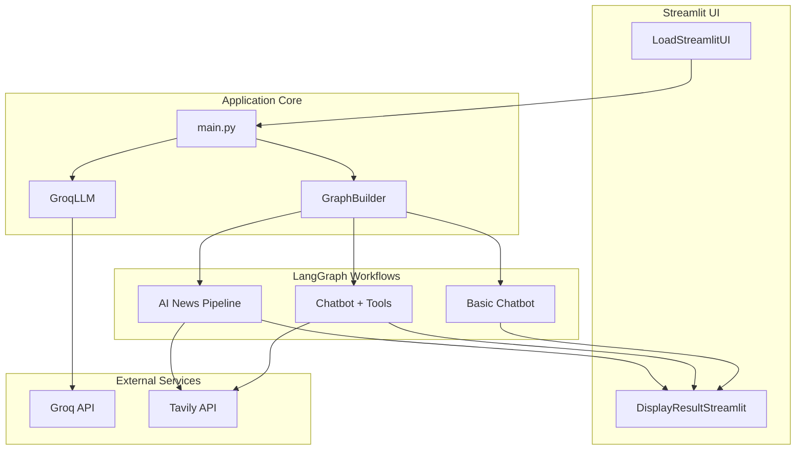
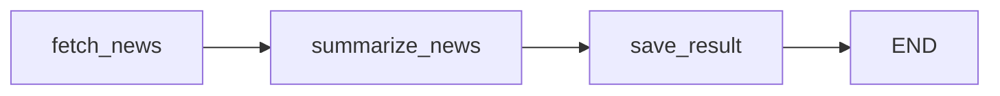
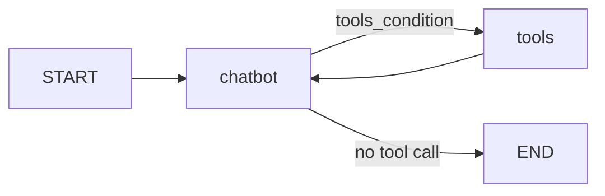

<div align="center">

# 🤖 Agentic AI Chatbot

**Production-ready conversational AI powered by LangGraph, Groq, and real-time web search**

[](https://www.python.org/)
[](https://langchain-ai.github.io/langgraph/)
[](https://streamlit.io/)
[](https://groq.com/)
[](https://tavily.com/)

*Modular agent orchestration · Tool-augmented reasoning · Multi-step news pipelines*

[Features](#-features) · [Architecture](#-architecture) · [Quick Start](#-quick-start) · [Project Structure](#-project-structure) · [Deployment](#-deployment)

</div>

---

## Overview

**Agentic AI Chatbot** is an end-to-end demonstration of **stateful, graph-based AI agents** built with [LangGraph](https://langchain-ai.github.io/langgraph/). Instead of a single monolithic prompt chain, the application composes **distinct agent workflows**—from simple chat to ReAct-style tool use and automated news research—behind one Streamlit interface.

The project showcases skills recruiters look for in modern AI engineering roles:

- **Agent orchestration** with explicit graphs, nodes, and state
- **LLM + tool integration** (Groq + Tavily) for grounded, up-to-date answers
- **Multi-step pipelines** with fetch → summarize → persist workflows
- **Clean separation of concerns** (UI, graph builder, nodes, tools, LLM config)
- **Cloud deployment** on Streamlit Community Cloud

---

## ✨ Features

| Mode | What it does | LangGraph pattern |
|------|----------------|-------------------|
| **Basic Chatbot** | Conversational Q&A with Groq models | Linear graph: `START → chatbot → END` |
| **Chatbot With Web** | Answers questions using live web search | **ReAct loop**: LLM decides when to call Tavily, then synthesizes results |
| **AI News Explorer** | Curates global AI news by timeframe | **Sequential pipeline**: fetch → summarize → save markdown report |

### Highlights

- **Stateful agents** — conversation history managed via LangGraph `State` with `add_messages` reducer
- **Pluggable use cases** — one `GraphBuilder` switches topology per user selection
- **Fast inference** — Groq API with models including Llama 3.1/3.3 and GPT-OSS variants
- **Real-time grounding** — Tavily search for web-augmented chat and news aggregation
- **Interactive UI** — Streamlit sidebar for model, use case, and API key configuration
- **Persistent outputs** — AI News mode writes structured markdown to `AINews/`

---

## 🏗 Architecture



### Request flow

1. User selects **LLM**, **model**, and **use case** in the Streamlit sidebar.
2. `GroqLLM` initializes `ChatGroq` with the provided API key.
3. `GraphBuilder.setup_graph(usecase)` compiles the appropriate LangGraph.
4. User message (or news timeframe) is passed into the graph.
5. `DisplayResultStreamlit` streams or renders results in the chat UI.

### AI News pipeline (multi-agent workflow)



- **fetch_news** — Tavily news search filtered by daily / weekly / monthly window  
- **summarize_news** — LLM formats articles into dated markdown with source links  
- **save_result** — Writes `{frequency}_summary.md` under `AINews/`

### Tool-augmented chat (ReAct)



The LLM binds Tavily search tools; LangGraph’s `tools_condition` routes between the chatbot and `ToolNode` until a final answer is produced.

---

## 🛠 Tech Stack

| Layer | Technologies |
|-------|----------------|
| **Orchestration** | LangGraph, LangChain Core |
| **LLM** | Groq (`langchain-groq`) — Llama 3.1 8B, Llama 3.3 70B, GPT-OSS 120B |
| **Search / Tools** | Tavily (`tavily-python`, `TavilySearchResults`) |
| **Frontend** | Streamlit |
| **Language** | Python 3.11+ |

---

## 📁 Project Structure

```
AgenticChatbot/
├── app.py                          # Streamlit entry point
├── requirements.txt
├── AINews/                         # Generated news summaries (markdown)
└── src/langgraphagenticai/
    ├── main.py                     # App bootstrap & orchestration
    ├── graph/
    │   └── graph_builder.py        # LangGraph topology per use case
    ├── state/
    │   └── state.py                # TypedDict state + message reducer
    ├── nodes/
    │   ├── basic_chatbot_node.py
    │   ├── chatbot_with_Tool_node.py
    │   └── ai_news_node.py
    ├── tools/
    │   └── search_tool.py          # Tavily tool + ToolNode factory
    ├── LLMS/
    │   └── groqllm.py              # Groq client configuration
    └── ui/
        ├── uiconfigfile.ini        # UI defaults (models, titles)
        └── streamlitui/
            ├── loadui.py           # Sidebar & session state
            └── display_result.py   # Graph invoke & chat rendering
```

---

## 🚀 Quick Start

### Prerequisites

- Python **3.11+**
- [Groq API key](https://console.groq.com/keys)
- [Tavily API key](https://app.tavily.com/) — required for **Chatbot With Web** and **AI News**

### 1. Clone the repository

```bash
git clone https://github.com/Ahad9044/Agentic-Chatbot.git
cd Agentic-Chatbot
```

### 2. Create a virtual environment

```bash
python -m venv venv

# Windows
venv\Scripts\activate

# macOS / Linux
source venv/bin/activate
```

### 3. Install dependencies

```bash
pip install -r requirements.txt
```

### 4. Run the application

```bash
streamlit run app.py
```

Open **http://localhost:8501**, enter your API keys in the sidebar, pick a use case, and start chatting.

### Optional: environment variables

You can set keys in a `.env` file (not committed) or enter them in the UI:

```env
GROQ_API_KEY=your_groq_key
TAVILY_API_KEY=your_tavily_key
```

---

## 🌐 Deployment

The app is designed for [Streamlit Community Cloud](https://streamlit.io/cloud):

1. Push the repo to GitHub.
2. Connect the repository in Streamlit Cloud.
3. Set **Main file path** to `app.py`.
4. Add `GROQ_API_KEY` and `TAVILY_API_KEY` under **Secrets** if you prefer not to type keys in the UI.

> **Note:** UI configuration is loaded from `uiconfigfile.ini` via a path relative to the config module, so it works on both Windows and Linux in production.

**Live demo:** *[Add your Streamlit Cloud URL here]*

---

## 💡 Design Decisions

- **Graph-per-use-case** — Each product mode gets its own LangGraph topology instead of one overloaded graph, keeping behavior predictable and testable.
- **Node-based modularity** — Business logic lives in dedicated node classes (`BasicChatbotNode`, `ChatbotWithToolNode`, `AINewsNode`), aligned with LangGraph best practices.
- **Config-driven UI** — Models and use cases are driven by `uiconfigfile.ini`, so non-developers can adjust options without code changes.
- **Streaming vs invoke** — Basic chatbot uses `graph.stream()` for incremental UX; tool and news flows use `invoke()` for full trace display.

---

## 🔮 Possible Extensions

- Conversation memory across sessions (checkpointer / SQLite)
- Additional tools (calculator, RAG over documents with FAISS)
- Observability with LangSmith tracing
- REST API layer (FastAPI) alongside Streamlit
- User authentication and rate limiting for production

---

## 📄 License

This project is open for portfolio and interview review. Add a license file (e.g. MIT) if you plan to open-source it formally.

---

## 👤 Author

**Ahad** — [GitHub](https://github.com/Ahad9044)

Built to demonstrate **agentic AI engineering**: LangGraph orchestration, tool use, and deployable LLM applications.

---

<div align="center">

⭐ If this project helped you understand agentic AI patterns, consider starring the repo.

</div>
